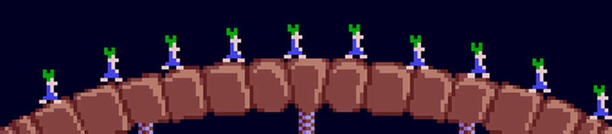
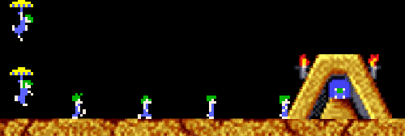

# Lemmings in VR
## A remake of the classic game in VR for the HTC VIVE

In this project, we sought to create a true to the original VR homage to the classic 2D game Lemmings. While many games can be easily ported into VR with minimal effort (many first-person games such as Skyrim and Fallout are already being ported), Lemmings is a game designed using only two dimensions. The original blockers prevent the lemmings from walking past, which makes sense on a screen, but in a three-dimensional space, it’s difficult to explain why they can’t just step to the side. Limitations of the medium such as these led us to pose the question: can a puzzle game such as Lemmings, whose use of two-dimensional qualities is crucial to the gameplay, be extrapolated to create a three-dimensional VR game?

## Sme of the jobs in action
### Blockers

### Bomb

### Parachute

### Builder

### Digger

## A complete level

## The controls

